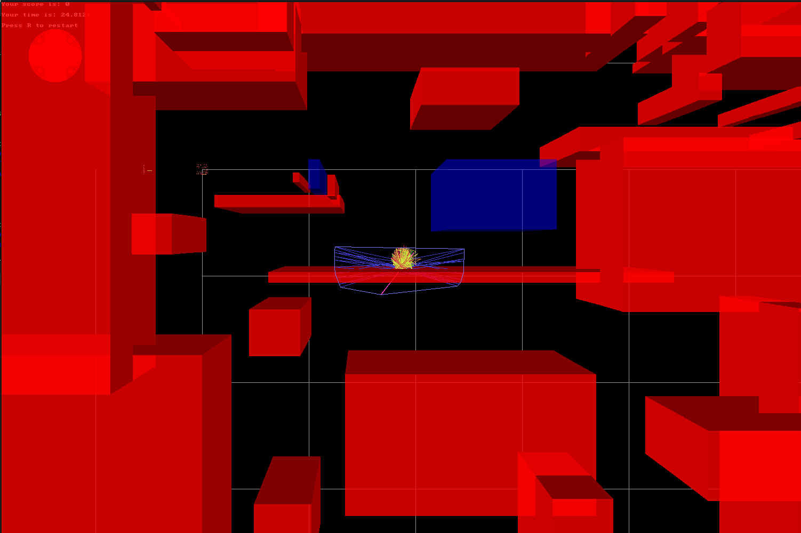
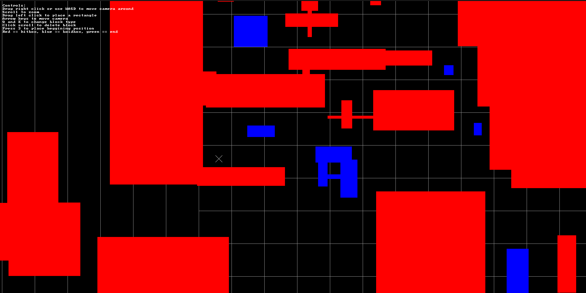

# main.c

a **2.5D game engine** written in C, featuring collision detection, boid collisions with boxes, and a simple level editor.

## Features

- 2.5D rendering with SDL  
- Collision handling  
- Boid collision behavior  
- Simple level editor (separate build, basic functionality)  

## How to Run

### Run the game engine

Simply compile and run the main program:

```bash
make
./main
```

### Run the level editor

The level editor is not included in the main build. Compile it separately with:

```bash
gcc editor.c -lSDL2 -lSDL2_test -lm -o editor
./editor
```

Note: The editor is basic and may require further improvements.

---

Enjoy experimenting with the engine and editor!
